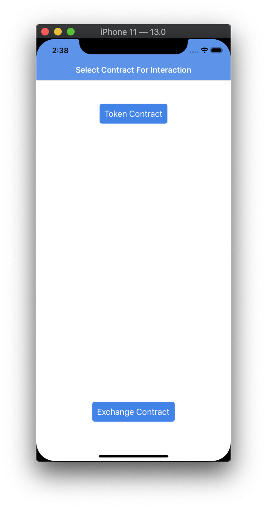

# DEXter-iOS

An iOS specific implementation of the DEXter exchange, a uniswap inspired exchange developed by [CamlCase](http://camlcase.io). Dexter is based off of [TezosKit](http://github.com/keefertaylor/TezosKit), an iOS SDK for the Tezos blockchain.

Additional Reading
- [TezosKit](http://github.com/keefertaylor/TezosKit): An iOS SDK for the Tezos blockchain
- [DEXter](https://gitlab.com/camlcase-dev/dexter): A decentralized exchange built on the Tezos blockchain.

## Getting Started

DEXter-iOS is packaged as a simple Xcode project. Just clone the repository, open the XCode project, build and run!

```shell
# Clone repo
$ git clone https://github.com/keefertaylor/DEXter-iOS
$ cd DEXter-iOS

# Open Xcode
$ open DEXter-iOS.xcodeproj

# Build and Run!
```
